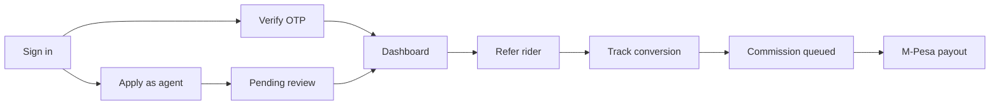
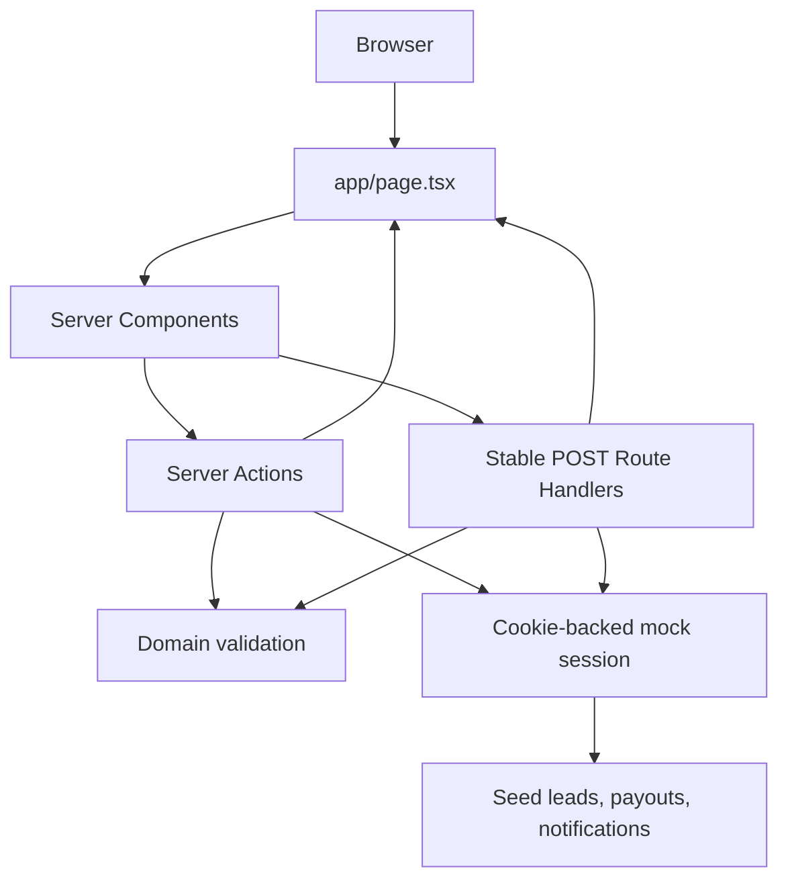

# Jiwambe Agent Portal

> A mobile-first agent experience for referring electric-bike riders, tracking conversions, and monitoring commission payouts.


## Overview

Jiwambe Agent Portal is a working, server-rendered prototype for a rider referral programme. Agents can sign in, qualify new leads, follow each rider through the conversion pipeline, and see paid or pending commissions.

The project deliberately uses mock data and cookie-backed state, so every main journey works locally without a database, SMS provider, M-Pesa integration, or back-office service.

### What is included

- Kenyan phone-number login and a mock SMS verification flow
- Self-registration with a simulated back-office approval step
- Rider lead capture with bike, licence, tenure, Bolt, and conduct qualification
- Active-phone duplicate protection and 30-day lead expiry rules
- Lead pipeline timelines with call and WhatsApp actions
- Activity notifications with unread badge state
- M-Pesa payout history and commission summaries
- Accessible conversion battery and paid/queued earnings visualisations
- Responsive mobile framing, fixed referral action, and viewport-anchored sheets
- Server Components, Server Actions, stable form Route Handlers, dynamic SSR, and Tailwind CSS
- Unit, server-rendered component, and end-to-end test coverage

## Demo

Use any valid Kenyan phone number and the fixed demo code:

| Field | Demo value |
| --- | --- |
| Phone | `0712 345 678` |
| OTP | `123456` |

You can also choose **Apply to become an agent** and complete the application flow. The final screen includes a button to simulate back-office approval.

### Main journeys



## Technology

| Area | Implementation |
| --- | --- |
| Framework | Next.js 16 App Router |
| UI | React 19 Server Components |
| Mutations | React Server Actions plus POST Route Handlers for file and lead forms |
| Rendering | Dynamic server-side rendering |
| Styling | Tailwind CSS 4 plus a small global animation layer |
| Language | TypeScript |
| Mock state | HTTP-only cookies and seeded records |
| Unit tests | Vitest |
| Component tests | React server rendering with Vitest |
| Browser tests | Playwright |

## Architecture

The page is rendered on demand. Query parameters select a view or dashboard tab, while mutations run on the server and redirect back to a newly rendered state.



### Server-rendered views

| View | Query example |
| --- | --- |
| Login | `/` |
| OTP | `/?view=otp` |
| Agent application | `/?view=apply` |
| Pending approval | `/?view=pending` |
| Dashboard | `/?view=dashboard` |
| Payouts | `/?view=dashboard&tab=payouts` |
| Statistics | `/?view=dashboard&tab=stats` |
| Add lead | `/?view=add` |

## Project structure

```text
app/
├── actions.ts                  # Login, application, notification, and lead actions
├── components/
│   ├── auth-screens.tsx        # Login, OTP, application, and approval screens
│   ├── dashboard.tsx           # Leads, payouts, statistics, sheets, and lead form
│   └── ui.tsx                  # Shared server-rendered UI primitives
├── globals.css                 # Tailwind import, motion, and component effects
├── layout.tsx                  # Metadata, viewport, and Inter font
└── page.tsx                    # Dynamic SSR view coordinator

lib/jiwambe/
├── domain.ts                   # Parsing, validation, calculations, and lead rules
├── mock-data.ts                # Seeded leads, payouts, earnings, and notifications
├── session.ts                  # HTTP-only cookie-backed mock persistence
└── types.ts                    # Portal domain types

tests/
├── e2e/portal.spec.ts          # Complete browser journeys
├── portal-domain.test.ts       # Domain and validation tests
└── server-components.test.tsx  # SSR markup and visual-contract tests
```

## Getting started

### Prerequisites

- Node.js 20.9 or newer
- npm

### Install and run

```bash
npm install
npm run dev
```

Open [http://localhost:3000](http://localhost:3000). If that port is occupied, Next.js will print the selected port in the terminal.

No environment variables or external services are required.

## Commands

| Command | Purpose |
| --- | --- |
| `npm run dev` | Start the development server |
| `npm run build` | Create a production build and type-check the app |
| `npm start` | Serve the production build |
| `npm run lint` | Run ESLint |
| `npm test` | Run domain and Server Component tests once |
| `npm run test:watch` | Run Vitest in watch mode |
| `npm run test:e2e` | Run Playwright journeys with a managed local server |

> [!IMPORTANT]
> Do not run `npm run build` while `npm run dev` is using the same workspace. Both commands write Next.js output and can invalidate a live development tab. Stop the dev server before building, then hard-refresh after restarting it.

## Testing workflow

Changes follow a red-green-refactor loop:

1. Add or update a test that describes the expected behaviour.
2. Run it and confirm the new expectation fails.
3. Implement the smallest production change.
4. Run the focused test until it passes.
5. Run the full unit, component, E2E, lint, and production-build checks.

Playwright starts its own Next.js server on port `3010`. To reuse an existing preview, provide its URL:

```bash
PLAYWRIGHT_BASE_URL=http://127.0.0.1:3000 npm run test:e2e
```

The browser suite covers:

- OTP success and failure
- Agent application and simulated approval
- Lead creation and duplicate rejection
- Lead timeline and contact actions
- Activity sheet and unread state
- Payout records and dashboard statistics
- Notification badge geometry
- Conversion battery animation
- Monthly paid and queued earnings charts

## Mock behaviour

This repository is intentionally a prototype:

- Authentication accepts any valid Kenyan phone and only OTP `123456`.
- Application uploads use a multipart Route Handler, avoiding the 1 MB Server Action body limit; the mock records only whether a file was supplied.
- Leads and applicant details are serialized into HTTP-only cookies.
- Seed payouts and activity notifications are static.
- Seed notifications restore on dashboard reload so the demo unread badge remains easy to inspect.
- Saved leads are capped to a small demo-friendly cookie payload.

Cookie storage keeps the mock functional across server-rendered navigations, but it is not a production persistence strategy.

## Production roadmap

Before shipping, replace the mock layer with:

- A database-backed agent, lead, event, and payout model
- Real OTP delivery and authenticated sessions
- Object storage plus secure ID-document processing
- Back-office review and lead-status APIs
- M-Pesa payout reconciliation and webhook handling
- Role-based authorization and audit logs
- Rate limiting, CSRF review, monitoring, and error reporting

## Design notes

The interface is optimised for a 430px mobile frame while remaining usable on desktop. The palette uses Jiwambe pine green for trust and action, mint for energy and progress, and restrained amber or red states for urgency.

Motion is decorative and automatically reduced when the operating system requests reduced motion.

---

Built as a focused, test-driven demonstration of the Jiwambe agent referral journey.
